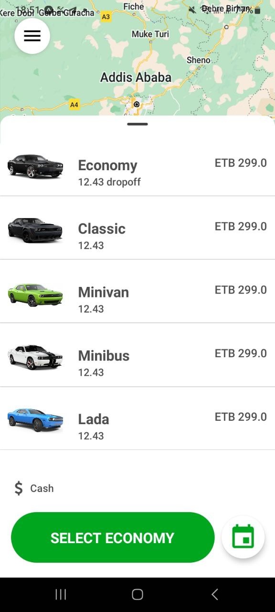

# Feres Mobile Application Clone

Welcome to the Feres mobile application clone repository! This project aims to replicate the functionality and user experience of Ethiopia's famous application, Feres. Feres is a versatile app that combines transportation, food delivery, and item delivery services, all wrapped in a beautiful user interface.

## About Feres

Feres is a widely-used application in Ethiopia, offering a seamless experience for users to access various services:

- **Transportation**: Easily book rides to navigate through the city with convenience.
- **Food Delivery**: Browse through a wide range of restaurants and cuisines, and have your favorite meals delivered to your doorstep.
- **Item Delivery**: Send and receive packages hassle-free, with reliable delivery services.

## Features

- **User-friendly Interface**: The clone replicates Feres' intuitive and visually appealing design.
- **Seamless Navigation**: Experience smooth navigation throughout the app, just like the original.
- **Secure Transactions**: Ensure safe and secure transactions for both users and service providers.
- **Real-time Tracking**: Track your orders and deliveries in real-time for enhanced convenience.

## Screenshots

<table>
  <tr>
    <td></td>
    <td></td>
    <td></td>
  </tr>
  <tr>
    <td></td>
    <td></td>
    <td></td>
    <td></td> <!-- This is an empty cell to maintain the layout -->
  </tr>
</table>

## Getting Started

To get started with the Feres mobile application clone, follow these steps:

1. Clone this repository to your local machine.
2. Install the necessary dependencies.
3. Run the application on your preferred platform.

## Contribution

Contributions are welcome! Feel free to fork this repository and submit pull requests to suggest improvements or fix any issues.

## Credits

This project is inspired by and based on the original Feres application in Ethiopia.
And
Baslael Workineh (Programmer)

## License

N/A

